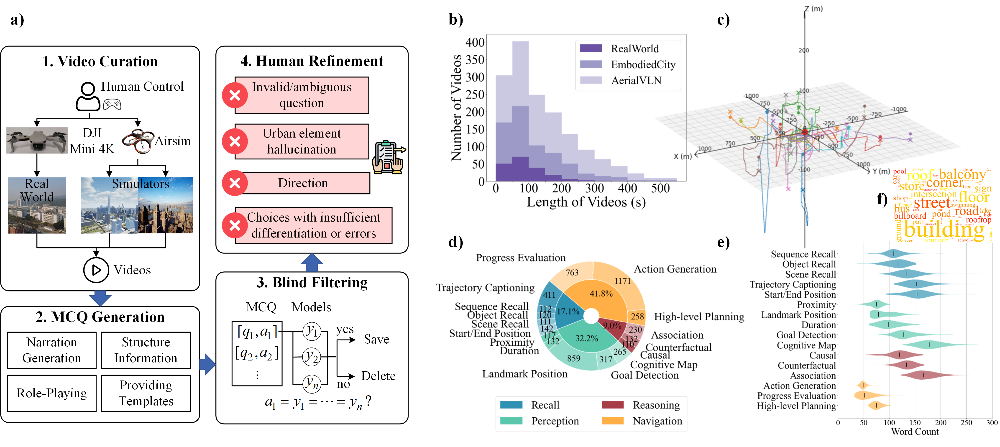

# UrbanVideo-Bench: Benchmarking Vision-Language Models on Embodied Intelligence with Video Data in Urban Spaces

The benchmark is designed to evaluate whether video-large language models (Video-LLMs) can naturally process continuous first-person visual observations like humans, enabling recall, perception, reasoning, and navigation.

- **Arxiv**: https://arxiv.org/pdf/2503.06157
- **Project**: https://embodiedcity.github.io/UrbanVideo-Bench/
- **Dataset**: https://huggingface.co/datasets/EmbodiedCity/UrbanVideo-Bench

## News
🎉 Accepted as an oral presentation at ACL 2025!

✅ Dataset Upload

✅ Dataset generation code

✅ Example code for running the benchmark with Video-LLMs

## Dataset generation
The pipeline includes four steps: video curation, MCQ generation, blind filtering, and human refinement. 
The dataset statistics are shown in the following figure b-f.



We provide three seperated scripts: Basic, Goal, and Route for generating questions with Gemini, as the workflows are slightly different due to differences in the forms of input data and features of tasks:

- For data consists of videos with destinations, we use the **Goal** script for the generation. This script is capable of generating question of the following categories:
   ```python
   question_categories = [
      "Trajectory Captioning",
      "Landmark Position",
      "Goal Detection",
      "Association",
      "Cognitive Map",
      "High-level Planning",
      "Action Generation"
   ]
   ```

- For data that include videos collected with specific movement instructions, we use the **Route** script to generate the questions. This script is capable of generating question of the following categories:
   ```python
   question_categories = [
    "Progress Evaluation",
    "Landmark Position",
    "Action Generation"
   ]
   ```

- For some questions in the Recall and Perception category, details from the videos are important, so we introduce an extra chain of thought in the **Basic** script, where objects and movements from the videos are extracted in advance and fed into the model for final generation. This script is capable of generating question of the following categories:
   ```python
   question_categories = [
    "Trajectory Captioning",   
    "Start/End Position",    
    "Object Recall",    
    "Sequence Recall",
    "Scene Recall", 
    "Proximity",
    "Duration",
    "Causal",
    "Counterfactual"
   ]
   ```


Follow the steps below to configure and execute the script `question_generation/MCQ_generation_basic.py` (the other two are similar):

1. Set your Gemini API key and select the appropriate model version:
   ```python
   model = "gemini-1.5-flash"
   genai.configure(api_key="SET_YOUR_API_KEY_HERE")
   ```

2. Configure the input and output paths:
   - **Input Path**: Specify the folder path containing `video_list.json` and the `.MP4` videos to be processed.
   ```python
   video_path = rf"DIRECT\PATH\TO\YOUR\VIDEO" # Replace with your video path. This path should contain video files with video_list.json.
   ```
   
   ```
   DIRECT\PATH\TO\YOUR\VIDEO/
   ├── video_list.json
   ├── video_1.mp4
   ├── video_2.mp4
   └── ...              # All the videos recorded in video_list.json
   ```
   - **Output Path**: Specify the path to the `.CSV` file where the results will be saved.
   ```python
   MCQ_PATH = rf"DIRECT\PATH\TO\YOUR\MCQ\FILE.csv" # Set your output MCQ file here. 
   ```

3. Finally, if you have set the direct path to your input and output files, you can execute the script by simply running the following command in the terminal:
   ```bash
   python question_generation/MCQ_generation_basic.py
   ```
   The results will be saved to the specified file.

## Example code for running the benchmark
### Data Preparation

To get started, download the dataset from [Hugging Face](https://huggingface.co/datasets/EmbodiedCity/UrbanVideo-Bench) 
and place it in the `dataset` folder within the project directory. 
After downloading, ensure the folder structure matches the one described below.
```
UrbanVideo-Bench.code/
├── dataset/
│   ├── videos/          # Contains video files used as input for the model
│   ├── MCQ.parquet      # Contains multiple-choice questions
│   └── ...
├── run.py               # Script for running the model and generating predictions
├── eval.py              # Script for evaluating the model's predictions
├── README.md            # Documentation for the project
└── ...                  # Other potential files or subdirectories
```


### Running

We provide a sample script, `run.py`, to run the dataset using an OpenAI-style API. Follow the steps below to configure and execute the script:

1. Set the model name in `run.py`:
   ```python
   model = "your_model_name"
   ```

2. Configure OpenAI API credentials:
   ```python
   client = OpenAI(
       api_key='your_api_key',
       base_url='your_base_url'
   )
   ```

3. Run the script:
   ```bash
   python run.py
   ```
   Results will be saved to `result/%s_output.csv`.


### Evaluation

The `eval.py` script is provided to evaluate the model's predictions. It extracts the options from the model's output and calculates the accuracy by comparing them to the ground truth.

1. Modify the file path in `eval.py` to match the output file from `run.py`:
   ```python
   file_path = 'result/gpt-4o_output.csv'  # Replace with your output file path
   ```

2. Run the script:
   ```bash
   python eval.py
   ```

3. The script compares predictions to ground truth and calculates accuracy. Results are saved to: `result/%s_acc.xlsx`

*Note: The extraction method here is the simplest regular matching. However, the output of small-sized models often does not follow instructions. So it needs to be adjusted separately.*


## Citation

If you use this project in your research, please cite the following paper:

```
@misc{zhao2025urbanvideobench,
      title={UrbanVideo-Bench: Benchmarking Vision-Language Models on Embodied Intelligence with Video Data in Urban Spaces}, 
      author={Baining Zhao and Jianjie Fang and Zichao Dai and Ziyou Wang and Jirong Zha and Weichen Zhang and Chen Gao and Yue Wang and Jinqiang Cui and Xinlei Chen and Yong Li},
      year={2025},
      eprint={2503.06157},
      archivePrefix={arXiv},
      primaryClass={cs.CV},
      url={https://arxiv.org/abs/2503.06157}, 
}
```
